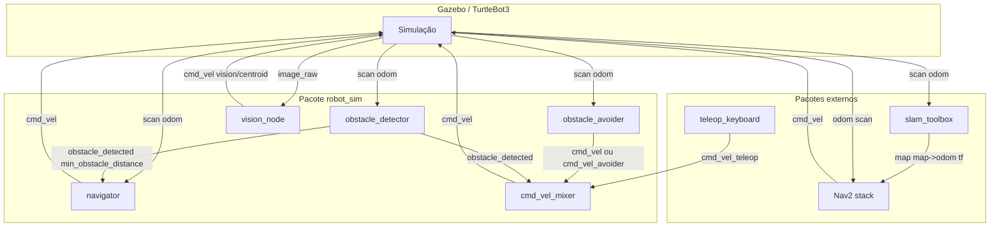

# Arquitetura do sistema

Visão geral dos nós e tópicos do projeto robot_sim e como eles se integram à simulação TurtleBot3 e ao Nav2.

---

## 1. Diagrama de nós e tópicos

- **Gazebo** publica `/scan`, `/odom` e assina `/cmd_vel`.
- **obstacle_detector:** lê `/scan`, publica `obstacle_detected` e `min_obstacle_distance`.
- **navigator:** lê `/odom`, `/scan`, `/goal` e `obstacle_detected`; planeja (A*) e controla (PID); publica `/cmd_vel`.
- **obstacle_avoider:** lê `/scan` (e opcionalmente `/goal` e `/odom`); publica `/cmd_vel` ou `cmd_vel_avoider`.
- **cmd_vel_mixer:** lê `cmd_vel_teleop`, `cmd_vel_avoider` e `obstacle_detected`; publica `/cmd_vel` (prioridade ao avoider quando obstáculo).
- **vision_node:** lê tópico de imagem; publica `vision/centroid` e opcionalmente `/cmd_vel`.
- **slam_toolbox:** lê `/scan` e tf (odom); publica `/map` e tf `map -> odom`.
- **Nav2:** usa mapa, AMCL, planner, controller; publica `/cmd_vel` (em modo Nav2 não se usa ao mesmo tempo o navigator A*+PID no mesmo robô).

---

## 2. Fluxo de dados (resumo)

1. **Sensores:** LaserScan (`/scan`) e odometria (`/odom`) vêm da simulação (ou do robô real).
2. **Processamento:** obstacle_detector, navigator, obstacle_avoider e vision_node consomem esses dados (e opcionalmente imagem).
3. **Atuadores:** O comando final em `/cmd_vel` pode vir do teleop, do navigator, do obstacle_avoider (direto ou via mixer) ou do Nav2; a simulação aplica ao robô.

Em cenários típicos:

- **Só teleop:** teleop publica em `/cmd_vel`.
- **Navegação A*+PID:** navigation.launch sobe obstacle_detector + navigator; navigator publica `/cmd_vel`.
- **Desvio só:** avoider.launch sobe obstacle_avoider → `/cmd_vel`.
- **Teleop com segurança:** teleop_with_avoider sobe obstacle_detector + obstacle_avoider (cmd_vel_avoider) + mixer; teleop com remap para `cmd_vel_teleop`; mixer escolhe avoider ou teleop e publica `/cmd_vel`.
- **Nav2:** nav2.launch sobe a stack Nav2; goals pelo RViz ou action; Nav2 publica `/cmd_vel`.

---

## 3. Frames (TF)

- **map** — referencial do mapa (slam_toolbox ou AMCL).
- **odom** — odometria (Gazebo ou driver).
- **base_footprint** / **base_link** — base do robô.

Cadeia típica: `map -> odom -> base_footprint`. O navigator (A*+PID) usa apenas `odom`; o Nav2 usa `map` e AMCL.

---

*Última atualização: mar. 2025.*
